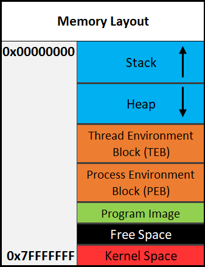

# Learning Assembly Lannguage (INTEL SYNTAX)


## X86 

This is a 32 bit register architechture. 

### Registers
- For Floating point values
    - XMM0 to XMM15 
- General Purpose: EAX, EBX, ECX, EDX,  ESI, EDI, EBP and ESP 
    - EAX : Accumulator registers (for arithmetic)
    - EBX : Base registers (for base pointer, sometimes return value and arguments to syscall)
    - ECX : Counter Register
    - EDX : Data registers


### BITS AND BYTES

Bit is one binary.
Nibble is 4 bits, one digit of a hex.
Byte is 8 bits, two digit hex.
Word is 2 bytes.
Double Word (DWORD) is 4 bytes. Twice the size of a word.
Quad Word (QWORD) is 8 bytes. Four times the size of a word. 


### Common Terms to know before proceeding (with Simple Assembly example)

- An immediate value (or just immediate, sometimes IM) is something like the number 12. An immediate value is not a memory address or register, instead, it's some sort of constant data.

- A register is referring to something like RAX, RBX, R12, AL, etc.

- Memory or a memory address refers to a location in memory (a memory address) such as 0x7FFF842B.


### Operand


#### Mul
takes only one one operand and multiplies it with the value stored in EAX and stores the result in EDX:EAX.

```x86asm
mov EAX, 25
mov EBX, 5
mul EBX ; Multiplies EAX (25) with EBX (5)
```

### Div

takes only one one operand and dividesEAX with the value stored in the operanf and stores the result in EDX:EAX.

```x86asm
mov EAX, 18
mov EBX, 3
div EBX ; Divides EAX (18) by EBX (3)
```

### CMP

CMP compares two operands and sets the appropriate flags depending on the result.

```
mov RAX, 8
cmp RAX, 5
```


### NOP

Nop is short for No Operation. This instruction effectively does nothing. its usually used for padding.


### Example

```x86asm
mov RAX, x          ; move variable from memory into register
cmp RAX, 4          ; compare immediate value with register value, set flag based on comparation
jne 0x7FFF842B      ; (ret) jump to a memory address 
call func1
ret
```


### STACK




## X86_64

Floating point : YMM0 to YMM15,  256-bit wide each and can hold 4 64-bit values or 8 32-bit values


## ARM


https://tryhackme.com/room/win64assembly